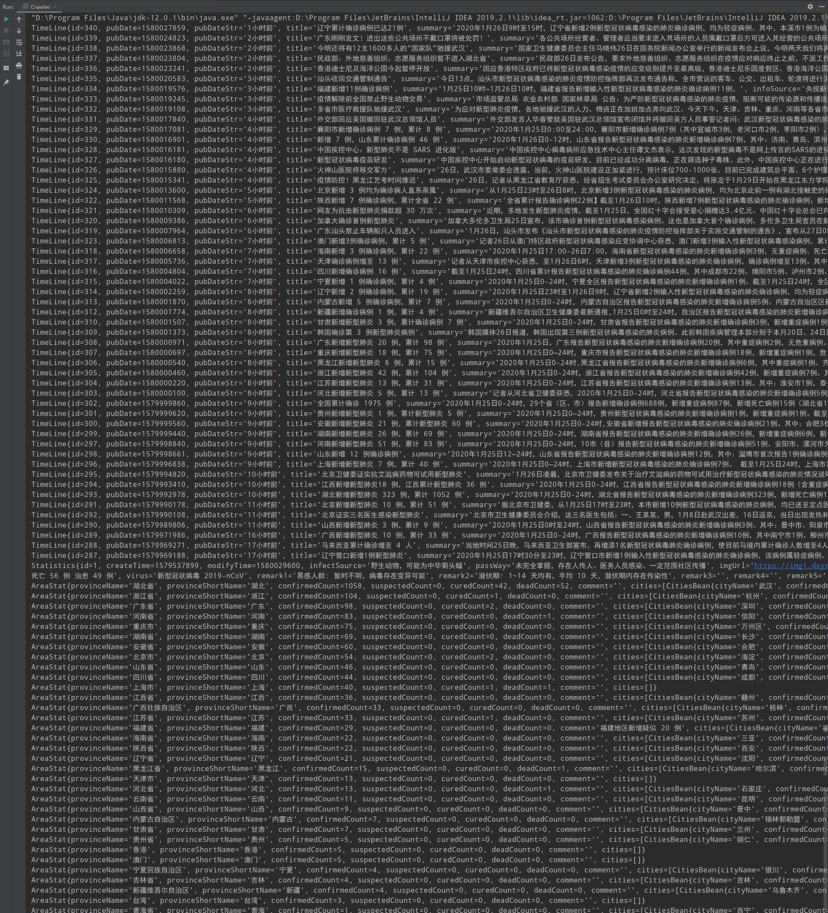
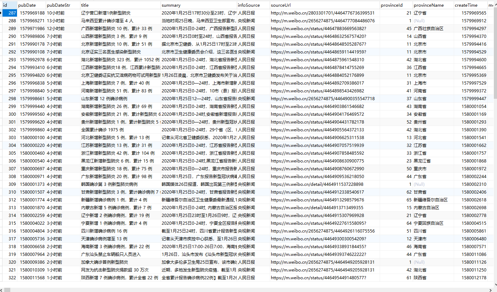

# 新型肺炎疫情数据爬虫+数据持久化+邮件通知

数据源来自“丁香园” ：https://3g.dxy.cn/newh5/view/pneumonia_peopleapp?from=timeline&isappinstalled=0

- 共三部分数据： 实时新闻 + 全局信息（全国 确诊 2055 例 疑似 2692 例 死亡 56 例 治愈 49 例） + 各省份疫情
- 数据库用MYSQL，建表语句在SQL目录下
- 功能：
  - jsoup获取数据，正则匹配筛选数据
  - 用mybatis+mysql做数据持久化
  - 数据发生变化时，发邮件通知

